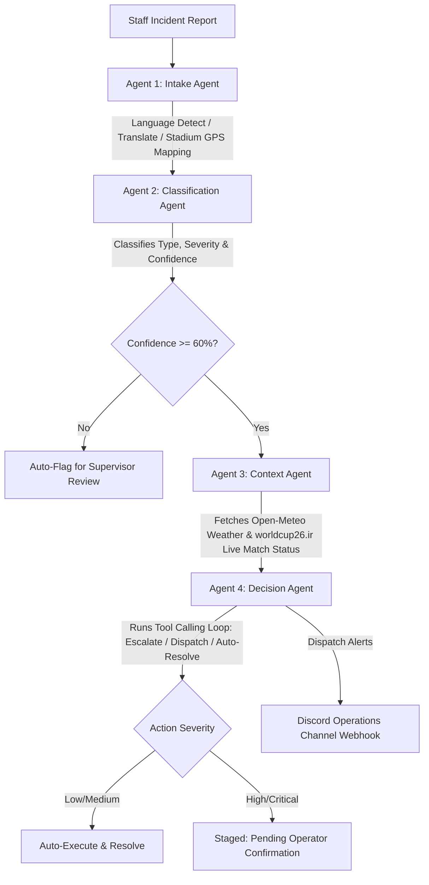

# StadiumOps IQ 🏟️

**StadiumOps IQ** is a GenAI-powered real-time decision support assistant designed for stadium operations staff during the FIFA World Cup 2026. Staff on the ground can report incidents in natural language (covering 17 different languages including Hindi, Spanish, French, Arabic, German, etc.). The system processes these reports through an autonomous 4-agent GenAI pipeline to classify, gather microclimatic and live match context, reason, decide, and prompt for human approval on high-stakes actions.

This project was built for the **PromptWars Virtual Hackathon Challenge 4: Smart Stadiums & Tournament Operations**.

🔗 **Live Demo:** [StadiumOps IQ — Smart Stadium Decision Support](https://stadiumopsiq-1.onrender.com/)

---

## Core GenAI Agent Pipeline



1. **Agent 1 — Intake Agent**: Detects the incoming report's language across all 17 supported languages, translates non-English inputs to English, maps the selected venue to its geographical coordinates, and parses the initial payload.
2. **Agent 2 — Classification Agent**: Classifies the incident category (e.g., medical, security, fire) and assigns a severity level (low, medium, high, critical) and confidence score. If confidence is below `0.60`, it flags the incident directly for supervisor review.
3. **Agent 3 — Context Agent**: Queries real-time weather data at the stadium coordinates (temperature, windspeed, precipitation) and checks current tournament match status (inactive, pre-match, first-half, halftime, second-half, post-match) to assess crowd risk levels.
4. **Agent 4 — Decision Agent**: Uses Groq tool calling to execute operational actions. Low/medium incidents are resolved immediately, while high/critical incidents enter a `pending-confirmation` state waiting for operator validation in the frontend dashboard. It also sends rich embedded notifications to the Discord operations webhook.

---

## Tech Stack

*   **Backend**: Node.js + Express + MongoDB Atlas (Mongoose)
*   **Frontend**: React + Vite + Tailwind CSS
*   **GenAI Engine**: Groq API (`llama3-70b-8192`) with function calling
*   **Real Live APIs**:
    *   **Open-Meteo API**: Microclimate current weather tracking.
    *   **worldcup26.ir Live API**: Stadium list registry and match progress metrics.
*   **Operations Notifications**: Discord Webhooks integration.

> Note: verify the Groq model ID above still resolves against your account before a fresh setup — Groq has retired several earlier `llama3-*-8192` IDs in favor of newer `llama-3.1-*` / `llama-3.3-*` model names.

---

## Folder Structure

```text
stadiumops-iq/
├── backend/
│   ├── server.js
│   ├── package.json
│   ├── models/
│   │   └── Incident.js
│   ├── routes/
│   │   └── incidents.js
│   ├── agents/
│   │   ├── intakeAgent.js
│   │   ├── classificationAgent.js
│   │   ├── contextAgent.js
│   │   └── decisionAgent.js
│   ├── services/
│   │   ├── openMeteoService.js
│   │   ├── worldCupService.js
│   │   └── discordService.js
│   ├── pipeline/
│   │   └── agentPipeline.js
│   └── middleware/
│       └── errorHandler.js
├── frontend/
│   ├── package.json
│   ├── vite.config.js
│   ├── tailwind.config.js
│   ├── index.html
│   └── src/
│       ├── main.jsx
│       ├── App.jsx
│       ├── styles/
│       │   └── index.css
│       ├── pages/
│       │   ├── Dashboard.jsx
│       │   ├── IncidentDetail.jsx
│       │   └── AuditLog.jsx
│       ├── components/
│       │   ├── Layout.jsx
│       │   ├── StatsBar.jsx
│       │   ├── IncidentForm.jsx
│       │   ├── IncidentFeed.jsx
│       │   ├── ReasoningTrail.jsx
│       │   ├── LiveContextPanel.jsx
│       │   └── ConfirmOverrideButtons.jsx
│       └── services/
│           └── api.js
└── README.md
```

---

## Getting Started

### 1. Configuration (`.env`)
Create a `.env` file under the `backend/` directory using the `.env.example` template:
```env
MONGODB_URI=mongodb+srv://...
GROQ_API_KEY=gsk_...
DISCORD_WEBHOOK_URL=https://discord.com/api/webhooks/...
PORT=5000
VITE_API_URL=http://localhost:5000
```

### 2. Start the Backend Server
```bash
cd backend
npm install
npm start
```

### 3. Start the Frontend Dev Server
```bash
cd frontend
npm install
npm run dev
```
Open `http://localhost:5173` in your web browser (Vite's default dev server port — check `frontend/vite.config.js` if you've overridden it).

---

## Live Deployment

The hosted version is live at **[stadiumopsiq-1.onrender.com](https://stadiumopsiq-1.onrender.com/)** for demo and judging purposes — no local setup required to try it out.
